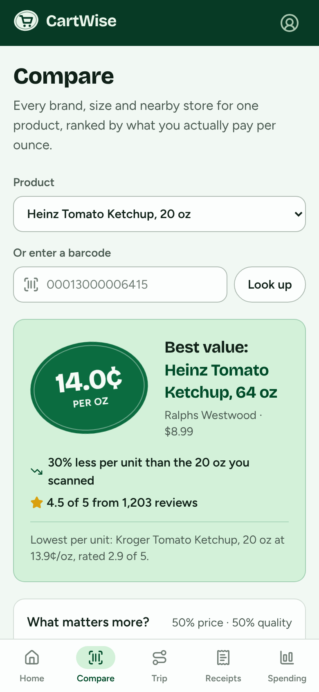
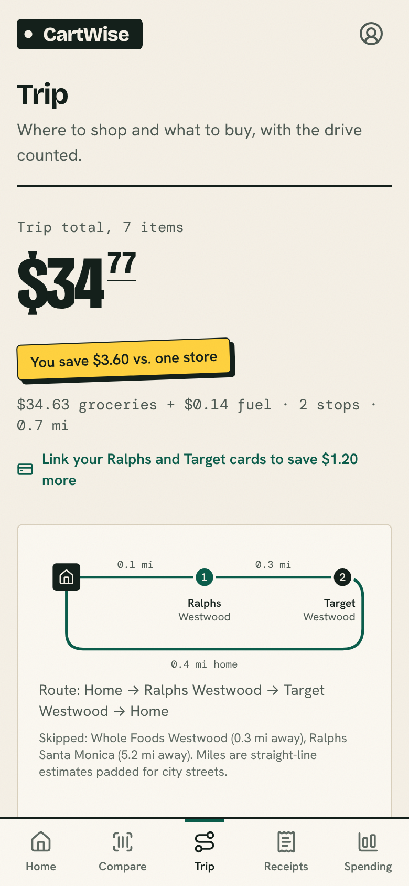
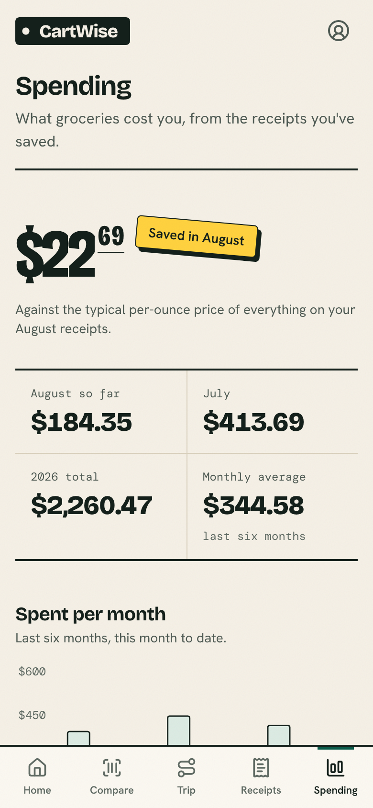
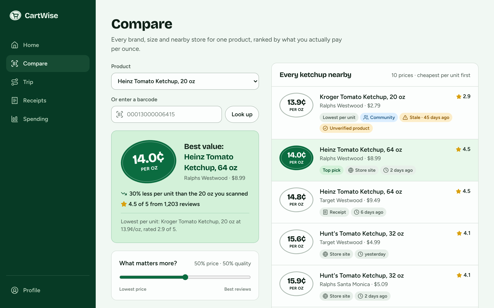

# CartWise

**The sticker price lies. CartWise shows what groceries really cost per ounce, and whether the
cheap store is worth the drive.**

Food prices keep climbing, and the number on the shelf tag hides the real deal. A 64 oz bottle of
ketchup costs twice as much as the 20 oz and is 30% cheaper per ounce. The store across town is a
dollar cheaper and burns two dollars of gas getting there. CartWise does that math for you, and the
receipts shoppers save keep every price current for everyone nearby.

Built for the 2026 Congressional App Challenge.

| Compare | Trip | Spending |
|---|---|---|
|  |  |  |



## Features

- **Compare.** Pick a product or type its barcode. CartWise lists every brand, size and nearby store
  that sells it, ranked by price per ounce, and picks a best value with a one-line reason. A slider
  trades price against reviews.
- **Trip.** Give it a shopping list. It decides which stores to visit and what to buy at each,
  counting fuel for the round trip, and shows what the two tempting alternatives would cost: one
  store, or chasing every lowest price.
- **Receipts.** Type in a receipt. Its prices update Compare and Trip right away and it counts toward
  your spending. The toast tells you how many prices it actually changed.
- **Spending.** This month, this year, a monthly chart and where the money went, all computed from
  your receipts.
- **Store cards.** Link a rewards card in Profile and that store's member prices start counting in
  Compare and Trip.
- **Unknown barcodes.** If a barcode isn't in the catalog, you add it. Your price shows up with a
  Community badge until a store source confirms it.
- Light and dark themes, phone and laptop layouts.

## How it works

**Per-unit normalization.** Every price is converted to cents per gram, millilitre or item before
anything is compared (`src/lib/units.ts`). Ranking refuses to mix dimensions: comparing $/g with
$/ml throws. The screens then show that number the way a US shelf tag does, per ounce or per fluid
ounce.

**Value scoring.** "Best value" rescales cheapness and review sentiment to 0..1 across the options
being compared and takes a weighted sum (`bestByValue` in `src/lib/compare.ts`). The slider sets the
weight. Unreviewed products score as neutral, not bad. Ties go to the lower price, so the same
package at a member and a public price never flips on row order.

**Trip optimization with travel cost.** `optimizeTrip` (`src/lib/trip.ts`) tries every set of up to
N nearby stores. Within a set, each item takes its best-value option. The set's stops are routed with
a brute-force shortest round trip from home, and fuel cost is added (25 mpg, $4.89/gal). The lowest
total wins, but a plan that can't buy everything on the list always ranks behind one that can.
Distances are straight-line times 1.3 for city streets (`src/lib/geo.ts`), so the planner costs
nothing to run. Swapping in a real distance API changes one file.

**Price provenance.** A price is never a field on a product. It is an observation: product, store,
time and source, appended to one log. The current price for each product and store is the newest
observation. A timestamp tie goes to the more trusted source: store website, then member account,
then receipt, then community report. Every price on screen shows its source and age, and anything
older than two weeks is marked stale. Receipts are stored and their prices are derived from them, so
deleting a receipt removes the prices it produced.

## Stack

React 19, TypeScript, Vite, Tailwind CSS v4, Recharts, lucide icons, React Router. Tests run on
Vitest and Testing Library.

There is no backend. The data layer is a small interface (`CatalogRepository`) with an in-memory
implementation seeded with sample data and persisted in the browser. The Postgres schema it mirrors
is in `supabase/migrations/`, ready for a hosted database later. All stores, prices and receipts in
this build are sample data for the Westwood area of Los Angeles.

## Run it

```
npm ci
npm run dev        # http://localhost:5173
npm test           # watch mode;  npx vitest run  for one pass
npm run build
```

## Project layout

```
src/lib/        units, compare, trip, geo, spending, savings, store: all pure logic, all tested
src/data/       the seeded catalog, prices and six months of receipt history
src/routes/     one file per screen
src/components/ the app shell, the per-unit sticker, and per-screen components
```
